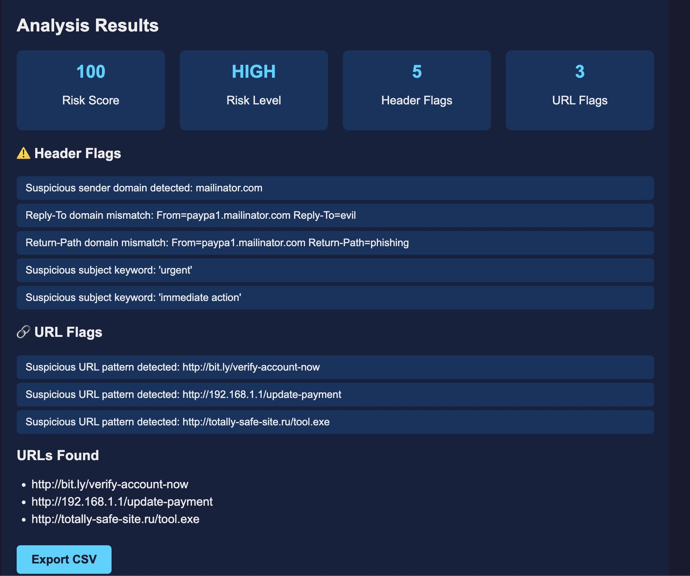
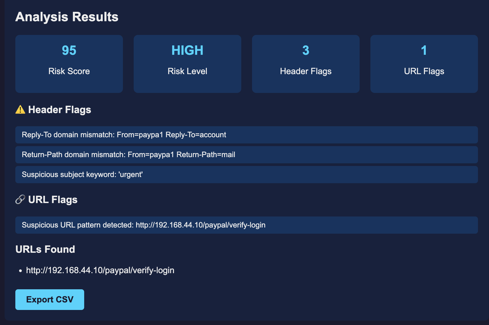
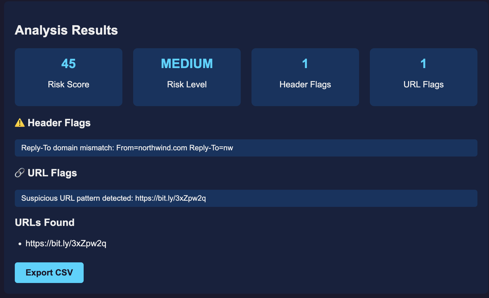
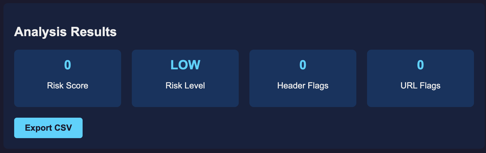
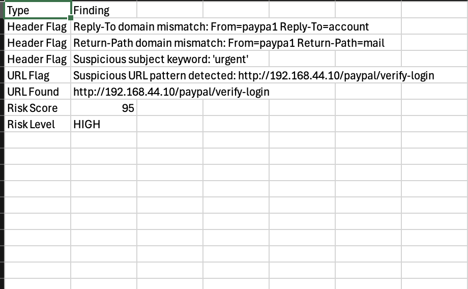
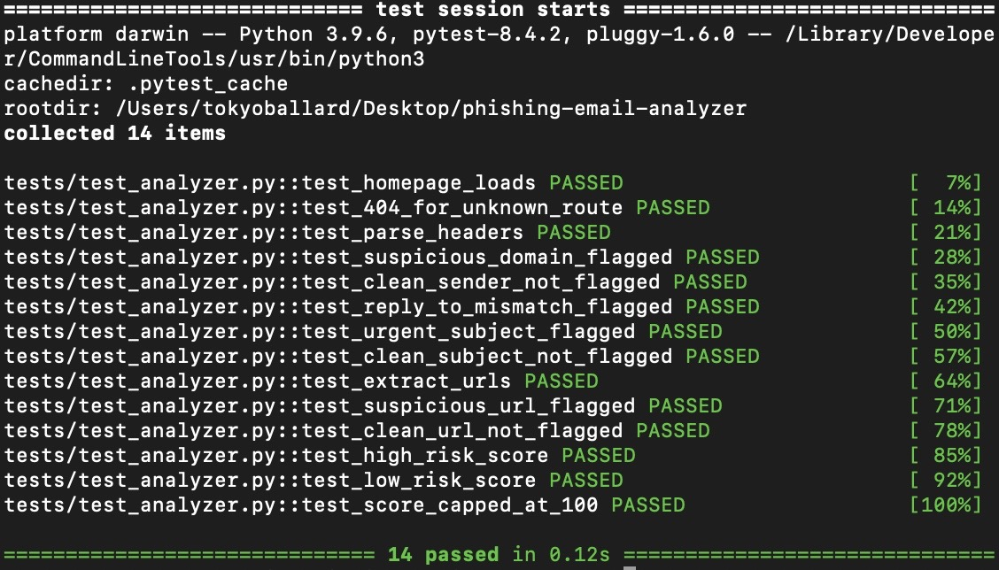

# Phishing Email Analyzer 🎣


A Python-based phishing email analyzer that parses raw email headers, detects suspicious indicators, flags malicious URLs, and assigns a phishing risk score through a Flask web dashboard.

## Screenshots



## Features

- Email header parsing and analysis
- Suspicious sender domain detection
- Reply-To and Return-Path mismatch detection
- Urgency keyword analysis in subject lines
- URL extraction and suspicious pattern detection
- Phishing risk scoring (0-100) with HIGH/MEDIUM/LOW classification
- Flask web dashboard for real-time analysis
- CSV export of findings

## How This Maps to Security Operations

This tool automates the first-pass triage a SOC analyst runs manually on a reported email — turning a raw header dump into a prioritized verdict.

| What the analyzer checks | What it means in a SOC |
|---|---|
| Sender domain + Reply-To / Return-Path mismatch | Sender spoofing and **BEC** (Business Email Compromise) — forged or look-alike senders are a top initial-access vector |
| Extracted URLs and suspicious link patterns | **Credential harvesting** — malicious links are **IOCs** (Indicators of Compromise) that analysts pivot and hunt on |
| Urgency keywords in the subject line | Social-engineering **TTPs** (Tactics, Techniques, and Procedures) — urgency and pressure are recurring phishing plays |
| 0–100 risk score with HIGH / MEDIUM / LOW | **Alert triage and prioritization** — scoring lets analysts work the highest-risk reports first |

Detection logic aligns with **MITRE ATT&CK T1566 (Phishing)**, primarily **T1566.002 – Spearphishing Link**, under the **Initial Access** tactic.

## Try It Yourself

Paste any of these samples into the dashboard to see each risk tier in action. All samples are fully fabricated — see [Sample Data & Attribution](#sample-data--attribution).

### Sample 1 — Expected: HIGH (score 95)

```
From: PayPal Security <service@paypa1-secure.com>
Reply-To: verify@account-update.ru
Return-Path: <bounce@mail-relay-92.ru>
Subject: URGENT: Your account has been suspended - verify immediately

Dear Customer,

We detected unusual activity on your account and access has been SUSPENDED.
You must verify your identity immediately or your account will be permanently closed.

Restore access now: http://192.168.44.10/paypal/verify-login

Failure to act within 24 hours will result in permanent suspension.

PayPal Security Team
```



### Sample 2 — Expected: MEDIUM (score 45)

```
From: IT Service Desk <itservicedesk@northwind.com>
Reply-To: it-support@nw-helpdesk-portal.net
Return-Path: <itservicedesk@northwind.com>
Subject: Action required: your password expires today

Hello,

Our system shows your network password is set to expire today. To avoid being
locked out, please reset it as soon as possible using the link below.

Reset password: https://bit.ly/3xZpw2q

If you have already updated your password, you can disregard this message.

IT Service Desk
```



### Sample 3 — Expected: LOW (score 0)

```
From: Sarah Chen <sarah.chen@northwind.com>
Reply-To: sarah.chen@northwind.com
Return-Path: <sarah.chen@northwind.com>
Subject: Notes from this morning's project sync

Hi team,

Thanks for a productive meeting earlier. I've updated the project timeline and
added my notes to our shared workspace.

Let me know if anything looks off before we send it on Friday.

Best,
Sarah
```



## Risk Scoring Methodology

Each email is scored on a 0–100 scale by tallying independent risk indicators:

- **Header flags — 25 points each.** Raised for suspicious sender domains, Reply-To / From mismatches, Return-Path / From mismatches, and urgency language in the subject line.
- **URL flags — 20 points each.** Raised for suspicious links such as IP-address URLs, URL shorteners, and look-alike or malformed domains.

The running total is capped at 100 and mapped to a risk level:

| Score | Risk level | Interpretation |
|---|---|---|
| 75–100 | **HIGH** | Multiple strong indicators — treat as likely phishing |
| 40–74 | **MEDIUM** | Some suspicious signals — review before trusting |
| 0–39 | **LOW** | Few or no indicators — likely legitimate |

Because flags are additive, a single email accumulates risk from independent signals — Sample 1 above scores 95 from three header flags (75) plus one URL flag (20).

## CSV Export

Findings can be exported to CSV from the results screen for record-keeping or downstream analysis. Exports are written to `reports/output/`.



## Limitations

This analyzer is a learning-focused foundation, not a production-tuned detection engine. Known limitations:

- **Static, rule-based scoring.** Weights are fixed per indicator; the tool does not learn from data, so an attacker avoiding these specific patterns can score LOW.
- **Keyword-based urgency detection.** Phrases outside the keyword list are missed — Sample 2's "Action required" subject does not trigger the urgency flag, while Sample 1's "URGENT" does.
- **No live threat intelligence.** URLs and domains are evaluated by pattern only — no reputation lookups, blocklists, or sandbox detonation.
- **Headers are trusted as provided.** They are not cryptographically verified against SPF, DKIM, or DMARC results.
- **No attachment analysis.** Malicious attachments are out of scope in the current version.

These are deliberate scoping choices, and they map to where a production SOC pipeline would add ML scoring, threat-intel feeds, and email-authentication checks.

## Sample Data & Attribution

All sample emails in this repository are fully fabricated for demonstration. No real phishing emails, real organizations' domains, or real individuals are used.

- **`paypa1-secure.com`** — an invented typosquat (letter "l" replaced with the numeral "1"), modeling a documented look-alike-domain technique. PayPal is referenced only as the brand being impersonated, mirroring how real phishing abuses trusted names.
- **`.ru` Reply-To / Return-Path domains** — invented, modeling the common pattern where replies route somewhere other than the displayed sender.
- **`192.168.44.10`** — deliberately a private (RFC 1918) address, guaranteed non-routable so the link can never reach a real site.
- **`bit.ly/3xZpw2q`** — a real shortener service with a fabricated slug that resolves nowhere.
- **Urgency language** ("suspended," "24 hours," "act immediately") — modeled on social-engineering pressure tactics documented in CISA and FTC phishing-awareness guidance.
- **"Northwind" and "Sarah Chen"** — fictional; Northwind is a well-known sample-company name from Microsoft's example databases.

No live malicious content exists anywhere in this repository.

## Tech Stack

- Python 3
- Flask
- Regex (built-in Python)

## Setup

Clone the repository, create and activate a virtual environment, and install dependencies from requirements.txt.

## Usage

Launch the dashboard with python3 dashboard/app.py and open your browser at http://127.0.0.1:5000. Paste raw email headers and body into the text box and click Analyze.

## Testing

Automated test suite with 14 pytest tests covering:

- Route validation
- Header parsing and sender analysis
- Suspicious domain and keyword detection
- URL extraction and pattern matching
- Risk scoring logic

Run tests:

```bash
python3 -m pytest tests/ -v
```



## Author

ShayVon Ballard

- GitHub: https://github.com/shayvon-ballard
